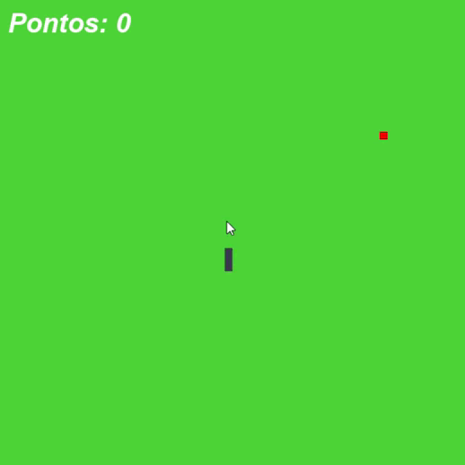

# 🐍 Jogo da Cobrinha (Snake Game)


Um  jogo da cobrinha desenvolvido em **Python** usando **Pygame**.
O jogo possui sistema de pontuação, aumento gradativo de velocidade, geração de obstáculos e tela de *Game Over*.

---

## 🎮 Demonstração

> Exemplo:



---

## 🚀 Funcionalidades

* Controle da cobra pelas setas do teclado
* Maçãs geradas aleatoriamente alinhadas à grade
* Obstáculos adicionados conforme o jogador pontua
* Aumento de velocidade a cada 3 pontos
* Detecção de colisão com:

  * paredes
  * corpo da cobra
  * obstáculos
  * maçã
* Tela de *Game Over*

---

## 📦 Como executar

### ✔️ Pré-requisitos

Certifique-se de ter instalado:

* **Python 3.8+**
* Biblioteca **pygame**

Instalação:

```bash
pip install pygame
```

### ▶️ Executando o jogo

Baixe os arquivos e execute:

```bash
python Jogo-Cobrinha.py
```

---

## 🧠 Lógica do jogo (Resumo)

* A cobra é representada por uma lista de coordenadas.
* Cada movimento desloca a cabeça e arrasta o restante do corpo.
* A maçã é gerada dentro da área da janela.
* A cada maçã comida:

  * A cobra cresce
  * Um novo obstáculo aparece
  * A velocidade aumenta a cada 3 pontos
* Game Over ocorre quando:

  * A cobra sai da tela
  * A cabeça encosta no corpo
  * A cabeça encosta em um obstáculo

---

## 📜 Código-fonte

O código completo do jogo está no arquivo `Jogo-Cobrinha.py`.
Ele utiliza módulos nativos do Python e o Pygame para renderização e controle de eventos.

---

## 💡 Melhorias futuras (opcional)

* Menu inicial
* Ranking de pontuação
* Skins para a cobra
* Níveis e modos diferentes
* Sons e música
